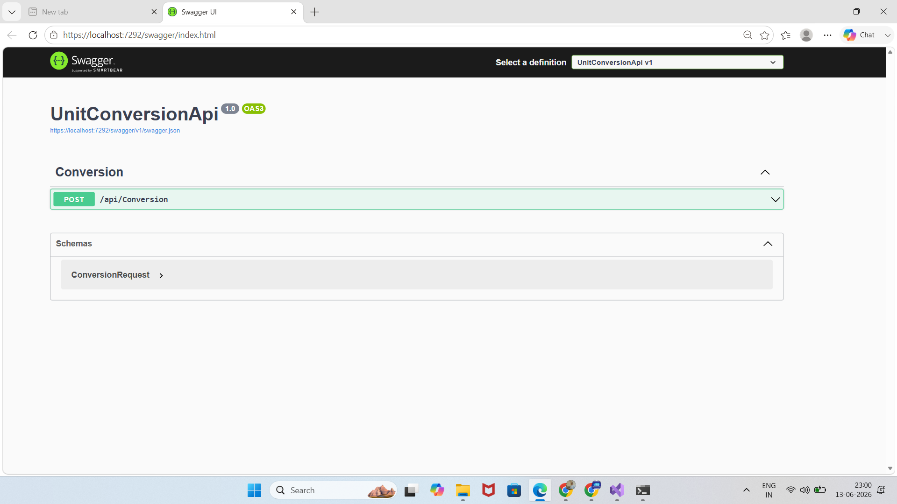
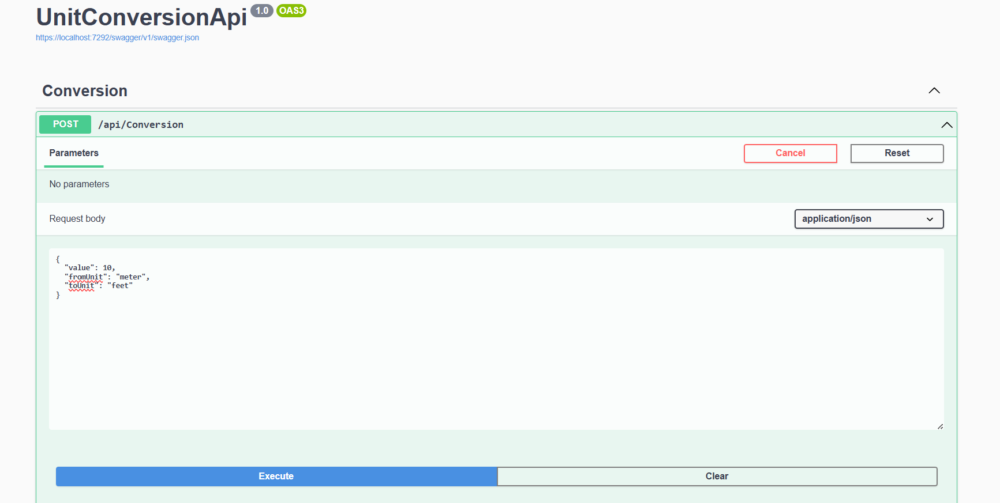
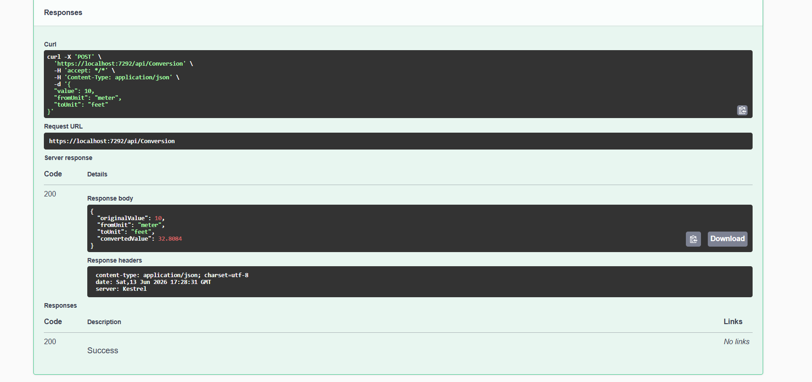
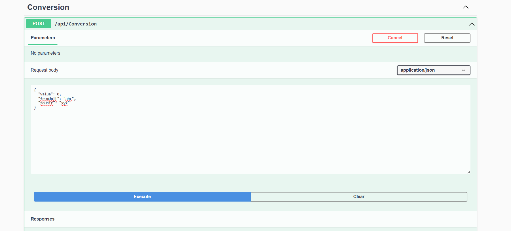
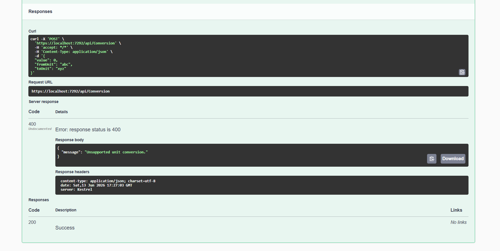
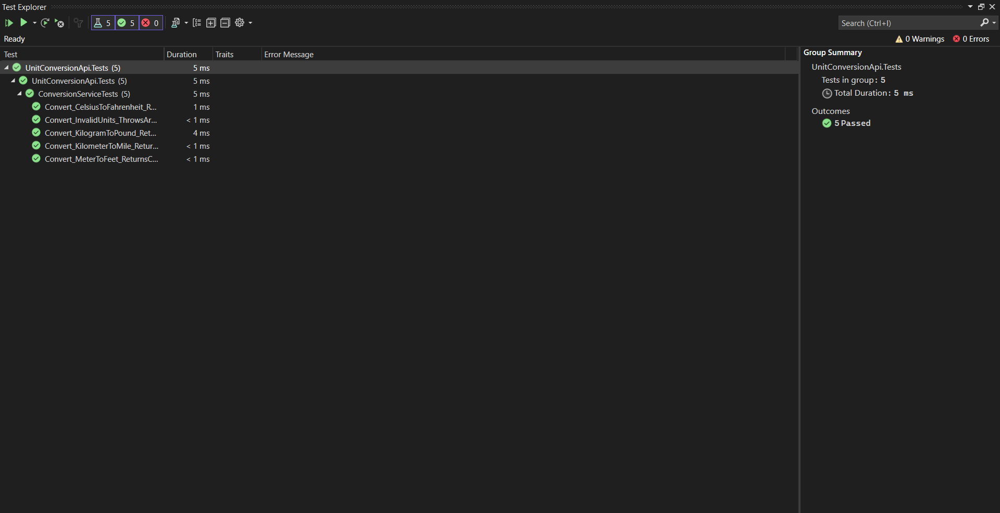

# Unit Conversion API

## Overview

Unit Conversion API is a RESTful ASP.NET Core Web API that converts values between different units of measurement. The application is designed using a layered architecture and can be easily extended to support additional unit categories and conversion types in the future.

### Supported Conversion Categories

#### Length

* Meter
* Kilometer
* Feet
* Mile

#### Weight

* Kilogram
* Gram
* Pound

#### Temperature

* Celsius
* Fahrenheit

---

## Technologies Used

* ASP.NET Core Web API (.NET 8)
* C#
* Swagger / OpenAPI
* Dependency Injection
* xUnit Testing Framework

---

## Project Architecture

The solution follows a clean layered structure:

```text
UnitConversionApi
?
??? Controllers
??? Services
??? Converters
??? Models
??? Program.cs
??? appsettings.json

UnitConversionApi.Tests
?
??? ConversionServiceTests.cs
```

### Components

* **Controllers**: Handle HTTP requests and responses.
* **Services**: Contain business logic for unit conversion.
* **Converters**: Implement conversion calculations for each category.
* **Models**: Define request and response objects.
* **Tests**: Verify conversion functionality using unit tests.

---

## Prerequisites

Before running the application, ensure the following are installed:

* .NET 8 SDK
* Visual Studio 2022

---

## Running the Application

1. Clone the repository.

2. Open the solution in Visual Studio 2022.

3. Build the solution:

```text
Build ? Build Solution
```

4. Run the application:

```text
F5
```

or

```text
Ctrl + F5
```

5. Swagger UI will open automatically.

Example:

```text
https://localhost:{port}/swagger
```

---

## API Endpoint

### Convert Units

**POST** `/api/Conversion`

### Sample Request

```json
{
  "value": 10,
  "fromUnit": "meter",
  "toUnit": "feet"
}
```

### Sample Response

```json
{
  "originalValue": 10,
  "fromUnit": "meter",
  "toUnit": "feet",
  "convertedValue": 32.8084
}
```

---

## Error Handling

If an unsupported conversion is requested, the API returns:

### Example Request

```json
{
  "value": 100,
  "fromUnit": "abc",
  "toUnit": "xyz"
}
```

### Example Response

```json
{
  "message": "Unsupported unit conversion."
}
```

**HTTP Status Code:** `400 Bad Request`

---

## Unit Testing

The project includes unit tests using xUnit.

### Run Tests

```text
Test ? Run All Tests
```

### Test Coverage

* Meter to Feet
* Kilometer to Mile
* Celsius to Fahrenheit
* Kilogram to Pound
* Invalid Unit Conversion

---

## Design Decisions

* Implemented a layered architecture to separate concerns.
* Used Dependency Injection for service registration and management.
* Conversion logic is isolated into dedicated converter classes.
* Dictionary-based unit definitions simplify adding new units.
* Validation and exception handling provide meaningful error responses.
* Unit tests verify the correctness of conversion logic.

---

## Future Enhancements

* Support additional unit categories
* Global exception handling middleware
* API versioning
* Logging and monitoring
* Database-driven unit configuration
* Caching for frequently used conversions

## Screenshots

### Swagger UI



### Successful Conversion





### Error Handling





### Unit Tests


